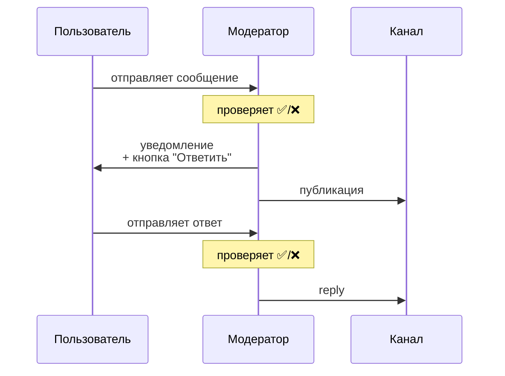

# AntiCensura Bot

Telegram бот для анонимных сообщений с модерацией и публикацией в канал.

## Возможности

### Для пользователей
- 📩 **Персональная ссылка** — уникальная ссылка для получения анонимных сообщений
- 📷 **Медиа-сообщения** — поддержка фото, видео, голосовых, стикеров, документов
- 💬 **Ответы в канал** — возможность ответить на своё сообщение после одобрения
- 📬 **История сообщений** — просмотр полученных сообщений с пагинацией
- 📊 **Статистика** — количество отправленных и полученных сообщений

### Для модератора
- ✅❌ **Модерация** — одобрение или отклонение сообщений перед публикацией
- 💬 **Ответ в ЛС** — личное сообщение отправителю
- 📢 **Ответ в канал** — публичный ответ от имени модератора (без модерации)
- 👁 **Уведомления** — информация о количестве сообщений на модерации

## Как это работает



## Установка

### 1. Клонирование и зависимости

```bash
cd Tgbot1
pip install -r requirements.txt
```

### 2. Создание бота

1. Откройте [@BotFather](https://t.me/BotFather)
2. Создайте бота: `/newbot`
3. Скопируйте токен

### 3. Настройка канала

1. Создайте канал или используйте существующий
2. Добавьте бота в канал как **администратора** с правом отправки сообщений
3. Получите ID канала:
   - Перешлите любое сообщение из канала боту [@getmyid_bot](https://t.me/getmyid_bot)
   - Используйте "Forwarded from chat" ID (начинается с `-100`)

### 4. Получение ADMIN_ID

Напишите боту [@userinfobot](https://t.me/userinfobot) — он покажет ваш ID

### 5. Конфигурация

Создайте файл `.env`:

```env
BOT_TOKEN=123456789:ABCdefGHIjklMNOpqrsTUVwxyz
ADMIN_ID=987654321
CHANNEL_ID=-1001234567890
MODERATION_ENABLED=true
```

| Параметр | Описание |
|----------|----------|
| `BOT_TOKEN` | Токен бота от @BotFather |
| `ADMIN_ID` | Ваш Telegram ID (модератор) |
| `CHANNEL_ID` | ID канала для публикации |
| `MODERATION_ENABLED` | `true` — модерация включена, `false` — публикация без проверки |

### 6. Запуск

```bash
python bot.py
```

## Использование

### Команды

| Команда | Описание |
|---------|----------|
| `/start` | Главное меню |
| `/help` | Справка по использованию |

### Кнопки меню

| Кнопка | Описание |
|--------|----------|
| 📩 Моя ссылка | Получить персональную ссылку |
| 📬 История сообщений | Просмотр полученных сообщений |
| 📊 Статистика | Количество сообщений |

### Модерация

После получения сообщения на модерацию:

| Кнопка | Действие |
|--------|----------|
| ✅ Одобрить | Публикует в канал, уведомляет отправителя |
| ❌ Отклонить | Уведомляет отправителя об отклонении |
| 💬 Ответить в ЛС | Личное сообщение отправителю |
| 📢 Ответить в канал | Публичный ответ модератора |

## Структура проекта

```
Tgbot1/
├── bot.py           # Основной файл бота
├── database.py      # Работа с SQLite
├── keyboards.py     # Inline-клавиатуры
├── config.py        # Загрузка конфигурации
├── requirements.txt # Зависимости
├── .env             # Конфигурация (не в git)
├── .env.example     # Пример конфигурации
└── anticensura.db   # База данных (создаётся автоматически)
```

## База данных

SQLite с таблицами:

- **users** — пользователи и их уникальные коды
- **messages** — все сообщения (статус, медиа, связи)
- **pending_replies** — хеши для анонимных ответов

## Формат сообщений в канале

```
📨 Анонимное сообщение:
Текст вопроса

    ↩️ Ответ:
    Ответ на сообщение
    
    👑 Ответ модератора:
    Официальный ответ
```

## Требования

- Python 3.10+
- aiogram 3.15+
- aiosqlite 0.20+

## Лицензия

Apache 2.0
